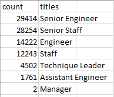

# Pewlett-Hackard-Analysis

## Overview of the analysis
This projuect is to determine the number of retiring employees per title, and identify employees who are eligible to participate in a mentorship program.

## Results

- There are over 90,000 (90,398) employees who are eligible to retire soon.

## Summary
